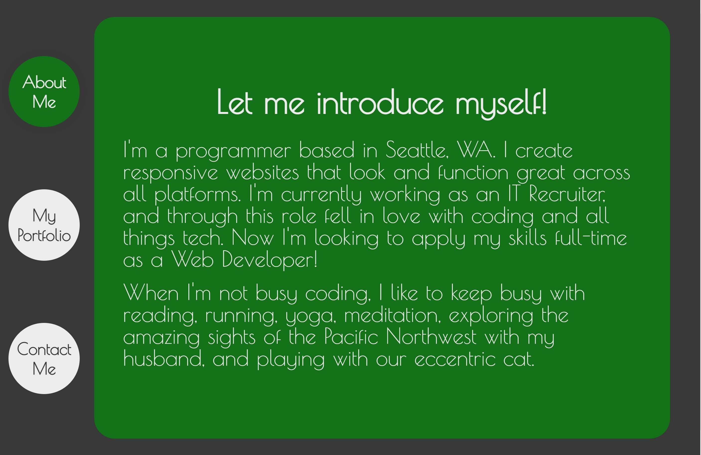
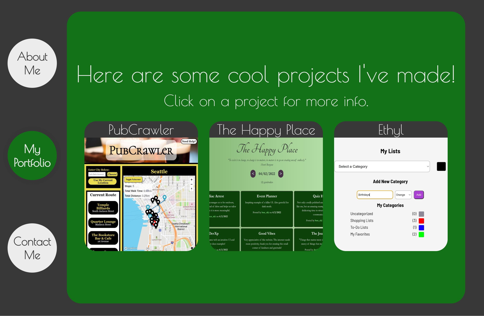
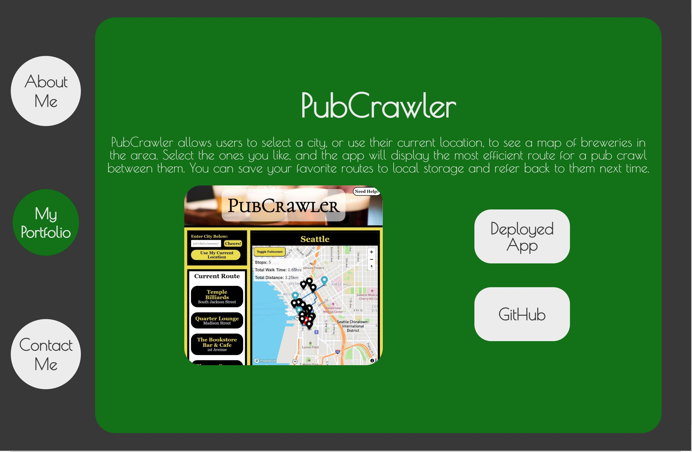

# React-Profile

Deployed Application: https://mike-fitzpatrick.herokuapp.com/home
GitHub Repository: https://github.com/mlfitz2/React-Profile

## Overview

This application is a reworking of the previous portfolio, built using React. Its sections include About Me, Contact Me including a downloadable resume, and a Portfolio with links to view more info on select projects. 

## Technologies

This was built using React.js, JavaScript, and CSS. 

## Screenshots

